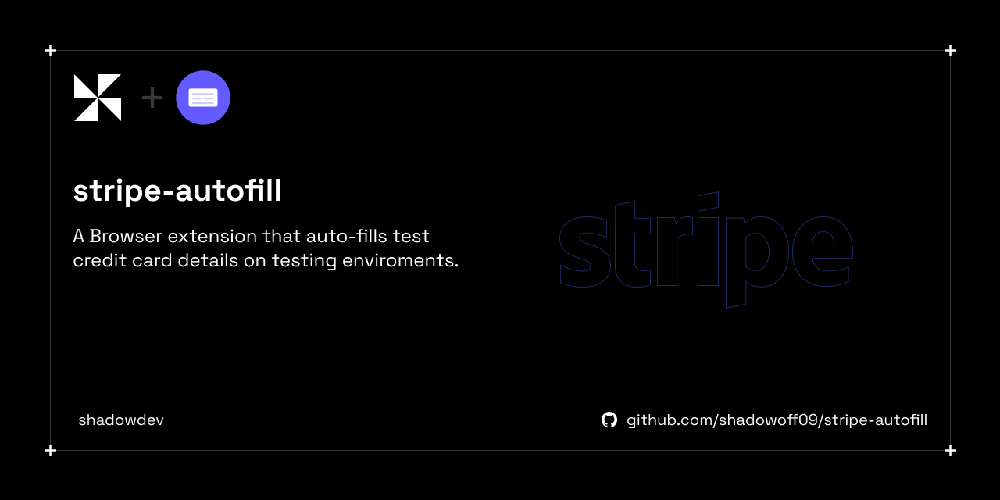

# Stripe Checkout Autofill Extension

<div align="center">
  
</div>

This browser extension auto-fills test credit card details on `https://checkout.stripe.com/` for testing purposes only.

## Test Details

- **Credit Card Number:** 4242424242424242
- **Expiration Date:** 12/34
- **CVC:** 123

## File Structure
```
stripe-autofill/
├── manifest.json
├── content.js
├── README.md
└── icons/
    ├── icon48.png
    └── icon128.png
```


## Installation

1. Open Chrome and navigate to `chrome://extensions/`.
2. Enable **Developer mode** in the top-right corner.
3. Click **Load unpacked** and select the `stripe-autofill` folder.
4. Navigate to `https://checkout.stripe.com/` to test the autofill functionality.

## Disclaimer

This extension is intended for testing environments only. Do not use in production.
